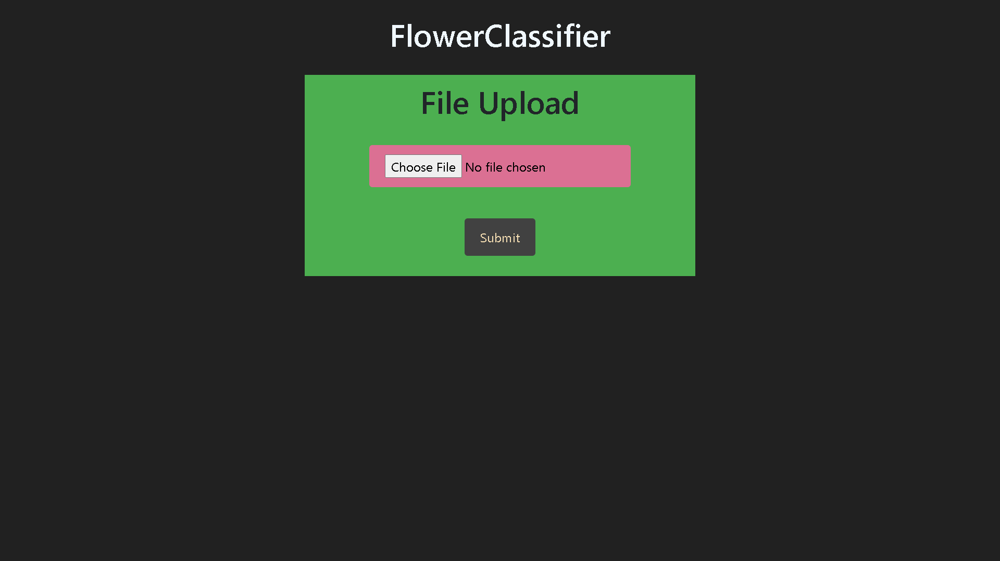
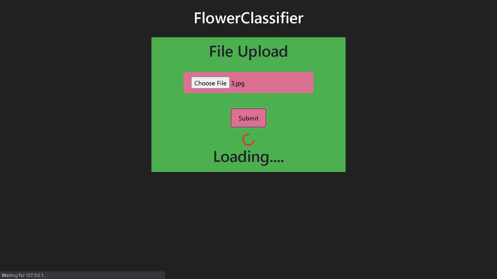
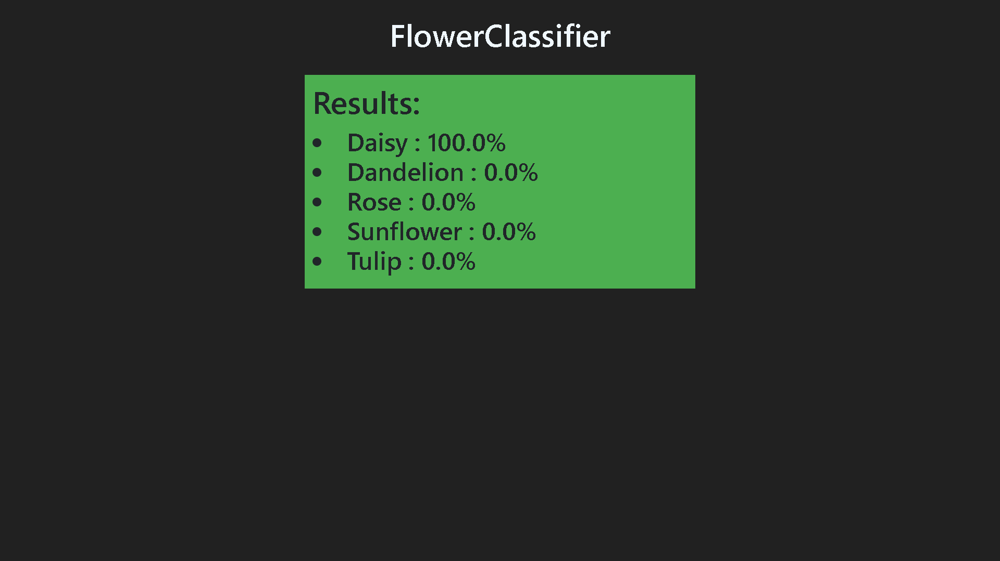

# FlowerClassifier 


## How to Use

Follow the Steps given below:

```
git clone https://github.com/TreeTracker/FlowerClassifier
cd FlowerClassifier
pip install -r requirements.txt
python main.py
```

## About

This is a Classifier which classifies any image into 5 classes of flowers
- Daisy 
- Dandelion 
- Rose 
- Sunflower 
- Tulip

## Technologies Used

- TensorFlow
- Python 
- Flask

## Screenshots




